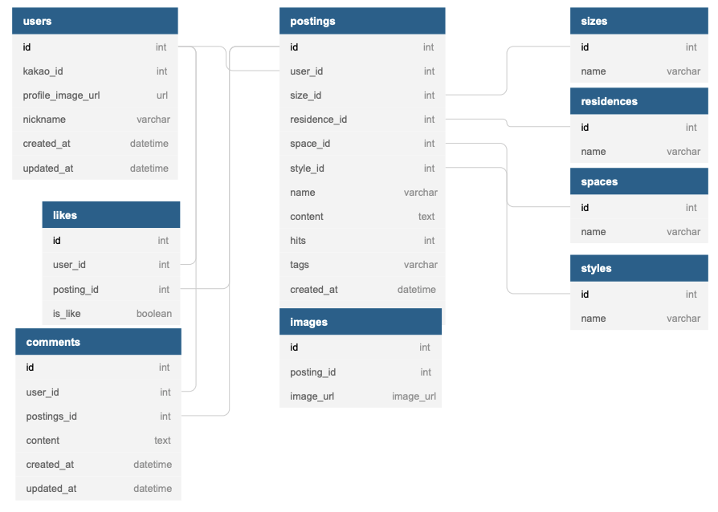

# 28-2nd-Barracks-backend
> 오늘의집(https://ohou.se/)은 콘텐츠, 커뮤니티, 커머스가 결합된 플랫폼입니다.
> 이커머스 웹사이트의 기능 구현 실습을 위해 커뮤니티 분야를 채택하여 프로젝트를 진행하였습니다.

 

## 개발인원 및 기간
- 개발기간 : 2022-01-10 ~ 2022-01-21
- Front-end : (https://github.com/wecode-bootcamp-korea/28-2nd-Barracks-frontend)
- Back-end : 이아영, 정병연, 지원석
  + 공통  : ERD/Modeling, CSV Uploader
  + 이아영 : 소셜 로그인/회원가입(카카오), 좋아요 기능, AWS EC2 배포
  + 정병연 : 포스팅 게시, AWS S3 이미지 업로더
  + 지원석 : 포스팅 불러오기, 댓글 기능

## 협업 도구

## 적용 기술

## library
- JWT
- boto3

## 시연 영상
- [**영상 링크**](https://www.youtube.com/watch?v=VWbA-JcUxvY)

## 구현 기능

### User
- SignUp : 카카오 토큰으로 DB 내 유저 조회, 신규 유저일 경우 회원등록
- LogIn  : 기존 회원에 한해 로그인 진행
- Decorator : 로그인 시 JWT 토큰 발행 및 토큰 인가로 호스트 등록

### Posting
- 포스팅에 들어갈 이미지 파일을 AWS S3 저장소에 저장
- 포스팅 목록에 필터링, 정렬 기능 적용
- Pagination
- 좋아요, 댓글 기능

## ERD

## Reference
- 이 프로젝트는 [**오늘의집**](https://ohou.se/) 사이트를 참조하여 학습목적으로 만들었습니다.
- 실무 수준의 프로젝트이지만 학습용으로 만들었기 때문에 이 코드를 활용하여 이득을 취하거나 무단 배포할 경우 법적으로 문제가 될 수 있습니다.
- 이 프로젝트에서 사용하고 있는 사진 대부분은 위코드에서 구매한 것이므로 해당 프로젝트 외부인이 사용할 수 없습니다.